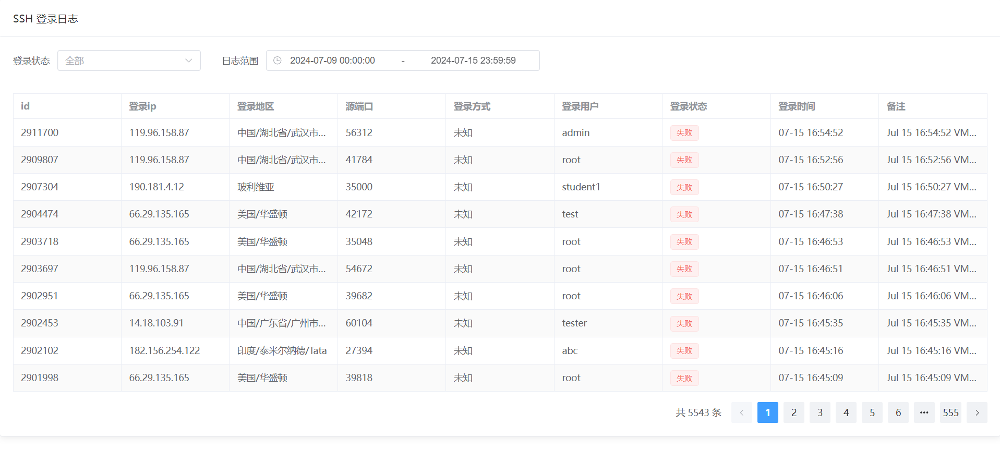

## 1.介绍

很简单的小功能，通过 web 来查看 ssh 的连接日志。

目前实现的方式是通过 `journalctl` 来查看 `sshd` 的日志。

支持 Docker 运行和 直接运行。



## 2.使用

克隆本仓库到本地

```shell
git clone https://github.com/BillSaul/ssh-log-web.git
```

```shell
cd ssh-log-web
```

### 2.1 Docker 运行

#### 2.1.1 构建镜像

```
docker build -t ssh-log-web:0.1 .
```

#### 2.1.2 运行容器

使用 `docker compose`

```
services:
  ssh-log-web:
    image: "ssh-log-web:0.1"
    restart: unless-stopped
    volumes:
      - "/var/log/journal:/www/log/journal:ro" # 日志目录
    environment:
      - TZ=Asia/Shanghai
      - API=localhost:43000 # 后端的api地址，默认为localhost:43000，请调整为自己服务器的ip地址和自己想要的端口
    network_mode: "host"
    container_name: ssh-log-web
    hostname: ssh-log-web
```

### 2.2 直接运行

#### 2.2.1 安装依赖

```shell
pnpm install
```

当然也可以使用 `npm`、`yarn` 来安装依赖。

#### 2.2.2 配置环境变量

修改 `.env` 文件中的 `API` 为自己服务器的ip和自己想要的端口

#### 2.2.3 运行

```shell
pnpm run server
```


### 2.3 访问

浏览器访问 `http://<服务器ip>:43000` 即可查看 ssh 日志。

## 3.Tips

**⚠️ web没有任何身份校验功能，如果需要请自行添加前置代理做好身份校验 ⚠️**

ip归属地信息查询由 [ip2region](https://github.com/lionsoul2014/ip2region) 提供支持
